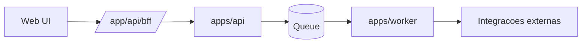

# Fluxo request -> API -> queue -> worker

```mermaid
flowchart LR
  U[Web UI] --> BFF[/app/api/bff/]
  BFF --> API[apps/api]
  API --> Q[(Queue)]
  Q --> W[apps/worker]
  W --> INT[Integracoes externas]
```

O BFF impõe allowlist de caminhos e centraliza headers/sessão.
