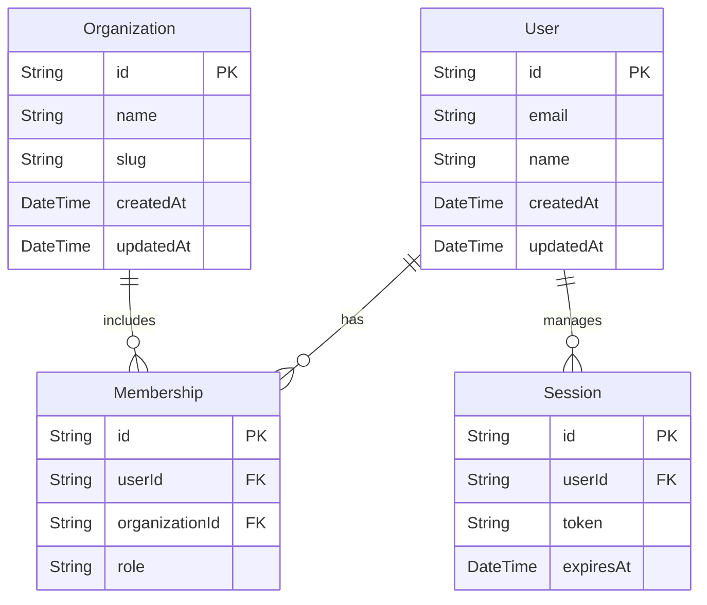

# Diagrama Entidade-Relacionamento (ERD) Inicial

```mermaid
erDiagram
    User ||--o{ Membership : has
    User ||--o{ Session : manages
    Organization ||--o{ Membership : includes
    User {
        String id PK
        String email
        String name
        DateTime createdAt
        DateTime updatedAt
    }
    Organization {
        String id PK
        String name
        String slug
        DateTime createdAt
        DateTime updatedAt
    }
    Membership {
        String id PK
        String userId FK
        String organizationId FK
        String role
    }
    Session {
        String id PK
        String userId FK
        String token
        DateTime expiresAt
    }
```
